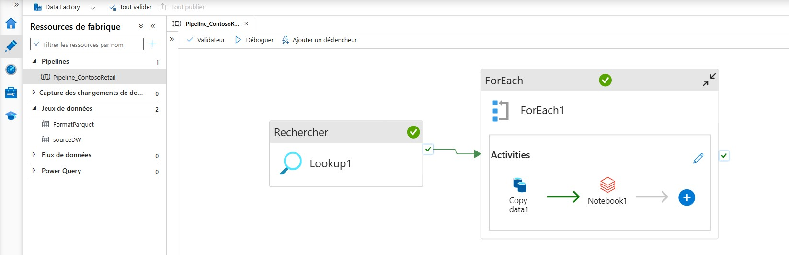

# 🥇 Medallion Architecture — DBT & Azure


Pipeline de données de bout en bout implémentant une **architecture Médaillon (Bronze → Silver → Gold)** sur Azure pour le jeu de données **Contoso Retail**. Le pipeline orchestre l'ingestion avec **Azure Data Factory**, le stockage brut avec **Azure Databricks / Unity Catalog** sur **Azure Data Lake Storage Gen2**, et les transformations analytiques avec **dbt Core** (snapshots SCD Type 2 et modèles marts en Delta Lake).


---

## 📑 Table of Contents

- [Features](#-features)
- [Tech Stack](#-tech-stack)
- [Architecture](#-architecture)
- [Installation](#-installation)
- [Requirements](#-requirements)
- [Environment Variables](#-environment-variables)
- [Usage](#-usage)
- [Development](#-development)
- [Deployment](#-deployment)
- [Project Structure](#-project-structure)
- [Configuration](#-configuration)
- [Testing](#-testing)
- [Troubleshooting](#-troubleshooting)


---

## ✨ Features

- **Découverte dynamique des tables sources** : le pipeline ADF interroge `information_schema.tables` sur la base Azure SQL source pour lister automatiquement les tables à ingérer (aucune table codée en dur).
- **Ingestion paramétrée en boucle** : une activité `ForEach` copie chaque table découverte vers la couche **Bronze** au format **Parquet** (compression Snappy), avec un partitionnement par date (`yyyyMMdd`).
- **Création automatique des tables Bronze** : un notebook Databricks déclenché par ADF crée les schémas et les tables externes Parquet pointant vers les fichiers Bronze.
- **Emplacements externes Silver / Gold** : configuration Unity Catalog (`EXTERNAL LOCATION`) pour sécuriser l'accès aux conteneurs Silver et Gold via une storage credential dédiée.
- **Historisation SCD Type 2 (Silver)** : 8 snapshots dbt (`currency_exchange`, `customer`, `date`, `order_rows`, `orders`, `product`, `sales`, `store`) capturent l'évolution des données sources en Delta Lake avec la stratégie `check`.
- **Modèles analytiques Gold** : 3 marts dbt matérialisés en table Delta :
  - `mart_customer_segmentation` — segmentation des clients (top 10 % du chiffre d'affaires), panier moyen, répartition par genre / âge / zone géographique.
  - `mart_delivery_logistics` — délai moyen de livraison par pays et par magasin, taux de commandes livrées en retard (> 7 jours).
  - `mart_sales_performance` — chiffre d'affaires, coûts et marges nettes par mois, magasin et catégorie de produit.
- **Tests de qualité de données** : contraintes dbt (`unique`, `not_null`, `accepted_values`) définies sur les colonnes clés des sources.
- **Documentation dbt** : les descriptions des sources et des colonnes sont prêtes pour générer la documentation dbt (`dbt docs generate`).

---

## 🧰 Tech Stack

| Catégorie | Technologie | Rôle dans le projet |
|---|---|---|
| Orchestration | **Azure Data Factory** | Découverte des tables, copie SQL → Parquet, déclenchement du notebook Databricks |
| Base de données source | **Azure SQL Database** (`ContosoRetail_DW`) | Source des données brutes (schéma `dbo`) |
| Stockage | **Azure Data Lake Storage Gen2** | Stockage des couches Bronze / Silver / Gold (conteneurs séparés) |
| Compute | **Azure Databricks** + **Unity Catalog** | Création des tables externes, gestion des secrets, exécution Spark |
| Format de données | **Parquet** (Bronze) / **Delta Lake** (Silver, Gold) | Formats de stockage optimisés |
| Transformation | **dbt Core** | Snapshots SCD2 (Silver) et modèles marts (Gold) |
| Langage | **SQL** (Jinja/dbt), **Python** (notebook Databricks) | Logique de transformation |
| Notebook | **Jupyter / Databricks Notebook** | Setup des couches Bronze, Silver, Gold |


---

## 🏛️ Architecture

Le flux de données suit le schéma ci-dessous :

```
Azure SQL Database (ContosoRetail_DW)
        │  (Lookup + ForEach : découverte dynamique des tables)
        ▼
Azure Data Factory — Pipeline_ContosoRetail
        │  (Copy data → Parquet, snappy)
        ▼
ADLS Gen2 — Conteneur "bronze"  ──────► Notebook Databricks (création tables externes)
        │
        ▼  (dbt snapshot, stratégie "check", SCD Type 2)
ADLS Gen2 — Conteneur "silver" (Delta Lake)
        │
        ▼  (dbt run — modèles marts)
ADLS Gen2 — Conteneur "gold" (Delta Lake)
        │
        ▼
Marts analytiques : customer_segmentation, delivery_logistics, sales_performance
```


### Détail des composants

- **`Lookup1`** (ADF) exécute une requête SQL sur `information_schema.tables` pour récupérer dynamiquement la liste des tables du schéma `dbo`, puis **`ForEach1`** itère sur chaque table trouvée.
- **`Copy data1`** (ADF) copie chaque table Azure SQL vers un fichier Parquet dans le conteneur `bronze` d'ADLS Gen2, puis **`Notebook1`** déclenche le notebook `notebook bronze` avec les paramètres `table_schema`, `table_name`, `fileName`.
- **`notebook db.ipynb`** (Databricks) crée le schéma/la base Bronze, la table externe Parquet, et configure les emplacements externes Silver et Gold.
- Les **snapshots dbt** (`medallion_dbt/snapshots/`) transforment la couche Bronze en couche Silver historisée (SCD Type 2, Delta Lake), puis les **marts dbt** (`medallion_dbt/models/marts/`) transforment la couche Silver en couche Gold.

---

## 🚀 Installation

### 1. Cloner le dépôt

```bash
git clone https://github.com/mlsanoh/Medallion-Architecture-DBT-Azure.git
cd Medallion-Architecture-DBT-Azure/medallion_dbt
```

### 2. Créer un environnement Python et installer dbt


```bash
python -m venv venv
source venv/bin/activate      # Linux / macOS
venv\Scripts\activate         # Windows

pip install dbt-databricks
```

### 3. Configurer le profil dbt

Le fichier `profiles.yml` n'est **pas versionné** (il est exclu via `.gitignore`). Créez-le manuellement dans `~/.dbt/profiles.yml` — voir la section [Configuration](#-configuration) pour un exemple.

### 4. Déployer les ressources Azure

Les ressources Azure Data Factory (`adf-contoso-analytics-pipeline/`) sont conçues pour être déployées via l'intégration Git d'ADF (branche de publication `adf_publish`, voir `publish_config.json`). Importez ce dossier dans votre Data Factory via **Manage → Git configuration**, ou publiez-le manuellement depuis le portail Azure.

Une fois importé, le pipeline `Pipeline_ContosoRetail` doit apparaître dans Data Factory sous la forme suivante :



---

## 📋 Requirements

| Prérequis | Détail |
|---|---|
| Compte Azure | Abonnement actif avec droits de création de ressources |
| Azure SQL Database | Base source contenant le schéma `dbo` (jeu de données Contoso Retail) |
| Azure Data Factory | Instance provisionnée, intégrée avec le dossier `adf-contoso-analytics-pipeline/` |
| Azure Data Lake Storage Gen2 | Compte de stockage avec les conteneurs `bronze`, `silver`, `gold` |
| Azure Databricks | Workspace avec Unity Catalog activé, cluster existant, secret scope configuré (`databricksScope` / clé `storage-key`) |
| Databricks Storage Credential | Credential nommée référencée par les `EXTERNAL LOCATION` (`sc-stcontosoanalytics` dans le notebook fourni) |
| Python | 3.9+ recommandé |
| dbt | `dbt-core` + adaptateur `dbt-databricks` |
| Git | Pour cloner le dépôt et gérer l'intégration ADF |

---

## 🔐 Environment Variables

Aucun fichier `.env` n'est présent dans le dépôt. Les paramètres de connexion sont gérés via le fichier `profiles.yml` de dbt (non versionné) et via les secrets natifs d'Azure (Key Vault côté ADF, Databricks Secret Scope côté notebook). Les variables ci-dessous sont **déduites** des fichiers de configuration présents dans le projet (`snapshots/*.sql`, `models/marts/*.sql`, `notebook db.ipynb`, `linkedService/*.json`) :

| Variable | Description | Required | Valeur par défaut |
|---|---|---|---|
| `DBT_DATABRICKS_HOST` | Nom d'hôte du workspace Databricks (ex. `adb-xxxx.azuredatabricks.net`) utilisé dans `profiles.yml` | ✅ | Aucune |
| `DBT_DATABRICKS_HTTP_PATH` | Chemin HTTP du cluster/warehouse SQL Databricks | ✅ | Aucune |
| `DBT_DATABRICKS_TOKEN` | Token d'accès personnel Databricks pour l'authentification dbt | ✅ | Aucune |
| `DBT_DATABRICKS_CATALOG` | Catalogue Unity Catalog cible (le notebook utilise `dbw_contoso_analytics`) | ✅ | `dbw_contoso_analytics` |
| `DBT_DATABRICKS_SCHEMA` | Schéma cible par défaut pour dbt | ✅ | `default` |
| `storage-key` (Databricks Secret Scope `databricksScope`) | Clé d'accès au compte de stockage ADLS Gen2, lue via `dbutils.secrets.get` dans le notebook | ✅ | Aucune |
| Storage Credential `sc-stcontosoanalytics` | Credential Unity Catalog référencée par les `EXTERNAL LOCATION` silver/gold | ✅ | Aucune |
| Connexion Azure SQL (`AzureSqlDatabase1`) | Serveur, base et identifiants d'authentification SQL utilisés par ADF (`sourceDW`) | ✅ | Aucune |


---

## 💻 Usage

### Exécuter le pipeline complet

1. **Déclencher le pipeline ADF** `Pipeline_ContosoRetail` (manuellement dans le portail Azure ou via un trigger planifié) — cela alimente automatiquement la couche Bronze et crée les tables externes correspondantes.
2. **Exécuter les snapshots dbt** pour matérialiser la couche Silver (historisation SCD2) :

```bash
cd medallion_dbt
dbt snapshot
```

3. **Exécuter les modèles marts dbt** pour matérialiser la couche Gold :

```bash
dbt run --select marts
```

4. **Interroger les marts** depuis Databricks SQL, par exemple :

```sql
SELECT * FROM dbw_contoso_analytics.dbo_marts.mart_sales_performance LIMIT 5;
```

---

## 🛠️ Development

Commandes dbt utiles pendant le développement (exécutées depuis `medallion_dbt/`) :

```bash
# Vérifier la connexion au profil dbt configuré
dbt debug

# Compiler les modèles sans les exécuter
dbt compile

# Exécuter uniquement les snapshots (couche Silver)
dbt snapshot

# Exécuter tous les modèles (couche Gold)
dbt run

# Exécuter un modèle spécifique
dbt run --select mart_sales_performance

# Lancer les tests de qualité de données définis dans source.yml
dbt test

# Générer et visualiser la documentation dbt
dbt docs generate
dbt docs serve

# Nettoyer les artefacts de build (target/, dbt_packages/)
dbt clean

# Compiler + exécuter + tester en une seule commande
dbt build
```

---

## ☁️ Deployment

Le déploiement combine deux mécanismes distincts observés dans le projet :

| Composant | Mécanisme de déploiement |
|---|---|
| **Azure Data Factory** | Intégration Git native d'ADF. Le fichier `publish_config.json` définit `publishBranch: "adf_publish"` : chaque publication depuis le portail ADF génère les templates ARM sur cette branche, qui peut ensuite être déployée via Azure DevOps/GitHub Actions ou manuellement. |
| **dbt (Silver / Gold)** | Aucun pipeline CI/CD n'est présent dans le dépôt (pas de workflow GitHub Actions ni Azure Pipelines). Le déploiement des modèles dbt se fait donc actuellement via exécution manuelle (`dbt build`) contre le workspace Databricks cible, en changeant de `target` dans `profiles.yml` si plusieurs environnements (dev/prod) sont nécessaires. |

---

## 📂 Project Structure

```
Medallion-Architecture-DBT-Azure/
├── adf-contoso-analytics-pipeline/       # Ressources Azure Data Factory (Git-integrated ADF)
│   ├── dataset/
│   │   ├── FormatParquet.json            # Dataset de sortie Bronze (Parquet, conteneur "bronze")
│   │   └── sourceDW.json                 # Dataset paramétré pointant vers Azure SQL (schéma/table)
│   ├── factory/
│   │   └── adf-contoso-analytics-pipeline.json  # Définition de la Data Factory (identité managée)
│   ├── linkedService/
│   │   ├── AzureDataLakeStorage1.json    # Connexion à ADLS Gen2
│   │   ├── AzureDatabricks1.json         # Connexion au cluster Databricks
│   │   └── AzureSqlDatabase1.json        # Connexion à la base Azure SQL source
│   ├── pipeline/
│   │   └── Pipeline_ContosoRetail.json   # Pipeline principal (Lookup → ForEach → Copy → Notebook)
│   └── publish_config.json               # Config de publication Git ADF
│
├── db_Architecture_Medallion_Contoso/
│   └── notebook db.ipynb                 # Notebook Databricks : setup Bronze + External Locations Silver/Gold
│
├── images/
│   ├── Architecture du projet.jpg        # Schéma global de l'architecture
│   └── Pipeline_ContosoRetail.jpg        # Capture du pipeline ADF
│
├── medallion_dbt/                        # Projet dbt Core
│   ├── analyses/                         # (vide — .gitkeep uniquement)
│   ├── macros/                           # (vide — .gitkeep uniquement)
│   ├── models/
│   │   ├── staging/
│   │   │   └── source.yml                # Déclaration des sources Bronze + tests dbt
│   │   └── marts/
│   │       ├── mart_customer_segmentation.sql
│   │       ├── mart_delivery_logistics.sql
│   │       └── mart_sales_performance.sql
│   ├── seeds/                            # (vide — .gitkeep uniquement)
│   ├── snapshots/                        # Snapshots SCD Type 2 (couche Silver)
│   │   ├── currency_exchange.sql
│   │   ├── customer.sql
│   │   ├── date.sql
│   │   ├── order_rows.sql
│   │   ├── orders.sql
│   │   ├── products.sql
│   │   ├── sales.sql
│   │   └── store.sql
│   ├── tests/                            # (vide — .gitkeep uniquement)
│   ├── dbt_project.yml                   # Configuration du projet dbt
│   └── .gitignore                        # Exclut profiles.yml, target/, dbt_packages/, logs/
│
├── .gitattributes
└── README.md
```

---

## ⚙️ Configuration

### `dbt_project.yml`

Définit la matérialisation par schéma :

| Dossier | Matérialisation | Schéma cible |
|---|---|---|
| `models/staging` | `view` | `staging` |
| `models/marts` | `table` | `marts` |
| `snapshots` | `snapshot` (SCD2, stratégie `check`) | `snapshots` |

### Exemple de `profiles.yml` (à créer manuellement, non versionné)

```yaml
medallion_dbt:
  target: dev
  outputs:
    dev:
      type: databricks
      catalog: dbw_contoso_analytics
      schema: default
      host: "{{ env_var('DBT_DATABRICKS_HOST') }}"
      http_path: "{{ env_var('DBT_DATABRICKS_HTTP_PATH') }}"
      token: "{{ env_var('DBT_DATABRICKS_TOKEN') }}"
      threads: 4
```


### Emplacements de stockage référencés dans le code

| Couche | Chemin ADLS Gen2 | Format |
|---|---|---|
| Bronze | `abfss://bronze@stcontosoanalytics.dfs.core.windows.net/` | Parquet |
| Silver | `abfss://silver@stcontosoanalytics.dfs.core.windows.net/` | Delta |
| Gold | `abfss://gold@stcontosoanalytics.dfs.core.windows.net/` | Delta |


---

## 🧪 Testing

Le projet inclut des **tests de qualité de données dbt** (pas de tests unitaires applicatifs), définis dans `medallion_dbt/models/staging/source.yml` sur les 9 tables sources (`currency_exchange`, `customer`, `date`, `order_rows`, `orders`, `product`, `sales`, `store`) : contraintes `unique` et `not_null` sur les clés primaires (`CustomerKey`, `OrderKey`, `ProductKey`, `StoreKey`, `Date`...), `not_null` sur les colonnes critiques (`Quantity`, `LineNumber`, `Exchange`...), et `accepted_values` sur `customer.Gender` (`male`, `female`).

Exécution :

```bash
dbt test
```

Les dossiers `tests/` (tests singuliers custom) et `macros/` (tests génériques custom) sont présents mais **vides** dans le dépôt actuel.

---

## 🩹 Troubleshooting

| Problème | Cause probable | Solution |
|---|---|---|
| `dbt debug` échoue avec une erreur d'authentification | `profiles.yml` absent ou mal configuré | Créer `~/.dbt/profiles.yml` avec un token Databricks valide (voir [Configuration](#-configuration)) |
| Les tables Bronze n'apparaissent pas dans Databricks | Le pipeline ADF n'a pas encore été exécuté, ou le notebook `notebook bronze` référencé dans `Notebook1` n'existe pas dans le workspace cible | Vérifier que le notebook est bien déployé au chemin `/Users/.../Architecture Medallion Contoso/notebook bronze` (chemin codé en dur dans `Pipeline_ContosoRetail.json`) et l'adapter si nécessaire |
| Erreur `EXTERNAL LOCATION already exists` ou credential introuvable | La storage credential `sc-stcontosoanalytics` référencée dans le notebook n'existe pas dans votre Unity Catalog | Créer la credential correspondante ou adapter son nom dans `notebook db.ipynb` |
| Erreur d'accès à `dbutils.secrets.get(scope="databricksScope", key="storage-key")` | Le secret scope Databricks n'est pas configuré | Créer le scope `databricksScope` et y ajouter la clé `storage-key` du compte de stockage |
| `dbt snapshot`/`dbt run` échouent sur `location_root` | Le nom de compte de stockage `stcontosoanalytics` est codé en dur dans les modèles/snapshots | Remplacer `stcontosoanalytics` par le nom de votre propre compte de stockage dans les fichiers `.sql` concernés |
| Le pipeline ADF ne trouve aucune table | La requête `Lookup1` filtre sur `table_schema = 'dbo'` | Vérifier que les tables source sont bien présentes dans le schéma `dbo` de `ContosoRetail_DW`, ou adapter la requête SQL |

---

